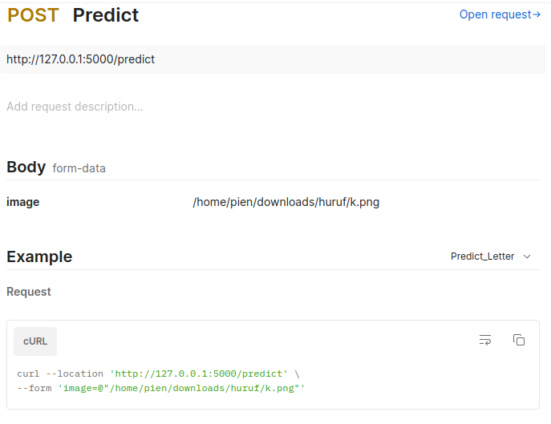
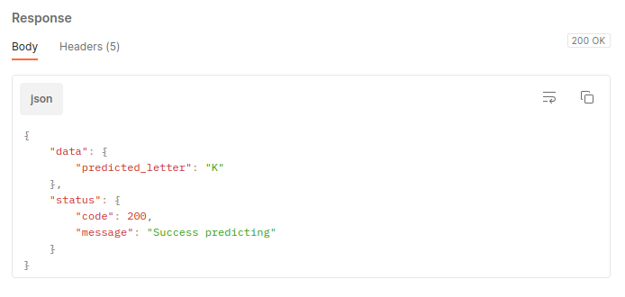

# Letter Recognition API

## Requirements
- Python3 
- venv

## How to run
1. Create virtual environment if it doesn't exist (`python -m venv venv-name`)
2. Activate the virtualenv (`venv-name/Scripts/activate` or `source venv-name/bin/activate` on linux)
3. Install all required modules/libraries with pip (`pip install -r requirements.txt`)
4. Run with flask (`flask run`)

Access API through http://127.0.0.1:5000

## Usage Documentation
To predict, upload an image contains a letter through predict endpoint `http://127.0.0.1:5000`.

Example request :

Example response :

